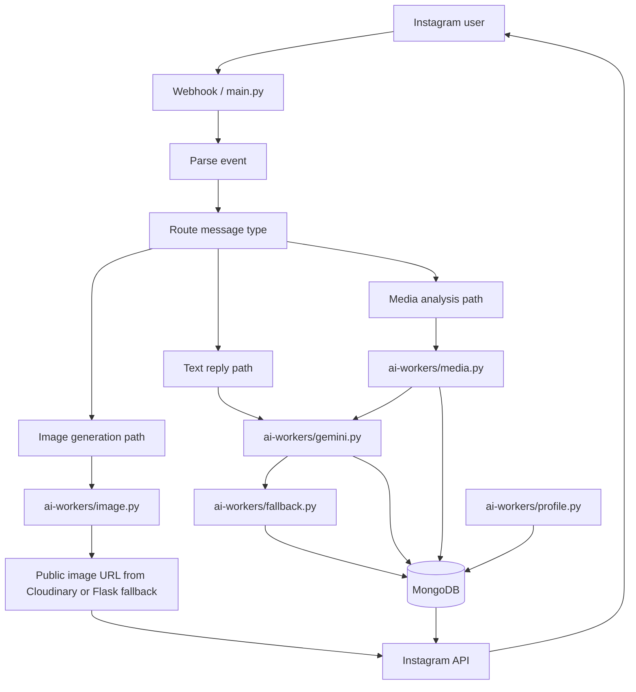

# Instagram AI Chatbot

Instagram bot for text replies, media analysis, and image creation. uses mongodb atlas for saving conversations to provide context based reponses. uses cloudinary to save generated images and incoming media when credentials are configured, with local storage as a fallback for generated images. worst part of this project was dealing with Meta api this is by far the WORST api i have ever used.

Powered by multiple AI services:

- Gemini API for primary replies and image analysis.
- Groq API as a fallback when Gemini fails or is rate limited.
- Cloudflare AI for image generation.

## Flow



## Active Behavior

- Regular DMs go through the text reply path.
- `/generate <prompt>` creates an image from the prompt and returns it to the user.
- Generated images are uploaded to Cloudinary when credentials are configured, with a local Flask-hosted fallback.
- Each user can generate 1 image per day.
- Media attachments are analyzed and answered in context.
- Incoming media can be uploaded to Cloudinary first; Gemini then receives a public URI when that path is available, with direct byte upload as a fallback.
- User profile/background updates run separately through the profile worker.

## Files

- [main.py](main.py) - webhook receiver and routing.
- [ai-workers/gemini.py](ai-workers/gemini.py) - text reply generation.
- [ai-workers/image.py](ai-workers/image.py) - image generation from prompt text.
- [ai-workers/media.py](ai-workers/media.py) - media download and analysis helpers.
- [ai-workers/profile.py](ai-workers/profile.py) - user profile updates.
- [ai-workers/fallback.py](ai-workers/fallback.py) - fallback reply generation.

## Image Requests

Use:

```text
/generate a cat wearing sunglasses
```

The bot will generate an image from the prompt and send it back.
## Meta and Graph API Setup Guide
First i have to say  navigating through meta api is a pain in the ass both the instagram api and whatsapp api.
Setting up an Instagram bot requires navigating the Meta App Dashboard, linking accounts, and generating specific access tokens. Meta keeps their platforms strictly sandboxed, so **do not skip any steps**. Keep your Meta app in "Development" mode until everything is working locally. you need two instagram accounts one you wish to automate (host) and the another one that tests as instagram only allow you to interact with accounts that are testers in developer. please note both of this accounts need to be either professional or creators account.


### Phase 1: Account Preparation & Linking

Before touching the developer dashboard, your Facebook and Instagram accounts must be properly linked.

* **Create or use a Facebook Page:** You must have admin access to a Facebook Page to route the bot's messaging.
* **Convert Instagram to Professional/Creator:** Open the Instagram mobile app. Go to Settings > Account type and tools > Switch to professional account.
* **Link the Accounts:** Open your Facebook Page settings on a desktop.in page settings  navigate to Linked Accounts > Instagram, and connect your professional Instagram account this is to the account you wish to automate or access via the API. toogle allow to allow the api to send and receive messages through the api.
* **Enable API Message Access (Crucial):** Open the Instagram mobile app again. Go to Settings and privacy > Messages and story replies > Message controls. Scroll down to "Connected tools" and toggle **Allow access to messages** ON. *If you skip this, the webhook will never fire.

### Phase 2: App Creation & Tester Roles

Your Meta App acts as the bridge between your code and the Meta Graph API.

* **Create the App:** Go to the [Meta App Dashboard](https://developers.facebook.com/apps/) and click **Create App**.
* **Select Type:** Choose **Other** -> **Business** as the app type (or select the custom business messaging setup if the UI prompts you).
* **Add Products:** On the App Dashboard, find "Add a Product" and set up **Instagram Graph API** and **Webhooks**.
* **Add Tester Accounts:** In the left sidebar, navigate to App Roles > Roles. Add your test Instagram account username under "Instagram Testers". this must be a spare account like i said you need two instagram accounts.
* **Accept the Invite:** The tester must accept this invite on their mobile device. Open the Instagram app > Settings and privacy > Website permissions > App invites, and click Accept.

### Phase 3: Webhook Configuration

Your webhook is how Meta tells your Python app that a new message has arrived.

* **Generate a Verify Token:** Run this quick Python snippet to generate a secure string: `python -c "import secrets; print(secrets.token_urlsafe(32))"`. Save this string; you will need it for your `.env` file and the Meta dashboard.
* **Start Your Local Tunnel:** Run `ngrok http 5000` to expose your local Flask server to the internet. Copy the `https://` forwarding URL.
* **Configure Meta Dashboard:** In the App Dashboard, navigate to Webhooks (or Messenger > Instagram Settings). Click **Edit Callback URL**.
* **Save Callback:** Paste your ngrok URL with the webhook endpoint attached (e.g., `https://your-ngrok-url.app/webhook`) and paste your Verify Token. Click Verify and Save.
* **Subscribe to Fields:** Once verified, click **Manage** next to Webhooks. Subscribe to the following fields: `messages`, `messaging_postbacks`, `message_reactions`, and `message_reads`.

### Phase 4: Permissions & Token Generation (The Tricky Part)

You need a Page Access Token to send messages. Generating a long-lived token requires using the Graph API Explorer.

* **Open the Explorer:** Go to the [Graph API Explorer](https://developers.facebook.com/tools/explorer/).
* **Select Your App:** In the right sidebar, select your newly created Meta App from the dropdown.
* **Add Permissions:** Click the "Add a Permission" dropdown. You must add exactly these: `pages_show_list`, `pages_read_engagement`, `pages_manage_metadata`, `instagram_manage_messages`, and `instagram_basic`.
* **Generate User Token:** Click **Generate Access Token**. A Facebook login popup will appear. Ensure you select the specific Facebook Page and linked Instagram account you are using.
* **Swap to Page Token:** Click the "User or Page" dropdown in the Explorer (right above the permissions list). Select your Facebook Page. The token string in the top bar will change. This is your short-lived Page Access Token.
* **Make it Long-Lived:** Copy the short-lived Page Access Token and open the [Access Token Debugger](https://developers.facebook.com/tools/debug/accesstoken/).
* **Extend:** Paste the token, click **Debug**, scroll down, and click **Extend Access Token**. Copy the new long-lived token. This is your `PAGE_ACCESS_TOKEN`.

---

## Quickstart

Follow these steps to get the bot running locally for development and testing.

**1. clone the repo and Set up the Python environment:**

```bash
pip install -r requirements.txt

```

**2. Configure the environment variables:**
Create a `.env` file in the project root. Never commit this file to version control.

```ini
# Meta API Configuration
VERIFY_TOKEN=your_generated_verify_token
PAGE_ACCESS_TOKEN=your_long_lived_page_token
GRAPH_API_VERSION=v21.0
INSTAGRAM_ID=your_instagram_account_id

# Database & Memory
MONGODB_URI=mongodb+srv://<user>:<pass>@<cluster>.mongodb.net/
DATABASE_NAME=instagram_bot
COLLECTION_NAME=chat_history
MEMORY_LIMIT=10

# AI Provider Keys
GEMINI_API_KEY=your_google_gemini_key
GROQ_API_KEY=your_groq_fallback_key

# Application Settings
PORT=5000
BOT_NAME=IG_Assistant

# Media Settings (Optional) you can use local storage 
CLOUDINARY_CLOUD_NAME=
CLOUDINARY_API_KEY=
CLOUDINARY_API_SECRET=
CLOUDINARY_FOLDER=
PUBLIC_BASE_URL=http://localhost:5000

```

**3. Run the application:**
Start the worker (which wraps `main.py` with auto-restart):

```bash
python worker.py

```

in local development we will use ngrok to expose our project to the internet so the url provided after running the command below is our webhook url. 
Remember to add ``` /webhook ```
 after the url
Keep your ngrok tunnel running in a separate terminal tab:

```bash
ngrok http 5000

```

---

## Architecture & Files

* `main.py` - The core Flask webhook receiver, request router, and Meta Graph API message dispatcher.
* `worker.py` - Auto-restart wrapper for `main.py`, highly recommended during development.
* `ai-workers/gemini.py` - Primary text reply generation and conversational analysis using the Gemini API.
* `ai-workers/fallback.py` - Fallback reply generation utilizing Groq if the primary LLM fails.
* `ai-workers/media.py` - Handlers for downloading incoming Instagram media attachments and passing them to context.
* `ai-workers/image.py` - Generates images via `/generate <prompt>` commands and handles Cloudinary uploads.
* `ai-workers/profile.py` - Manages persistent user profiling and background updates stored in MongoDB Atlas.

---

## App review 
am in the process of review for my first app i will update the readme file once i pass this stage 
 